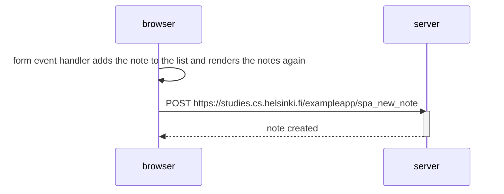

Sequence diagram of events when user creates new note in https://studies.cs.helsinki.fi/exampleapp/spa

```mermaid
sequenceDiagram
    participant browser
    participant server

    browser->>browser: form event handler adds the note to the list and renders the notes again
    browser->>server: POST https://studies.cs.helsinki.fi/exampleapp/spa_new_note
    activate server
    server-->>browser: note created 
    deactivate server
    activate server 
```